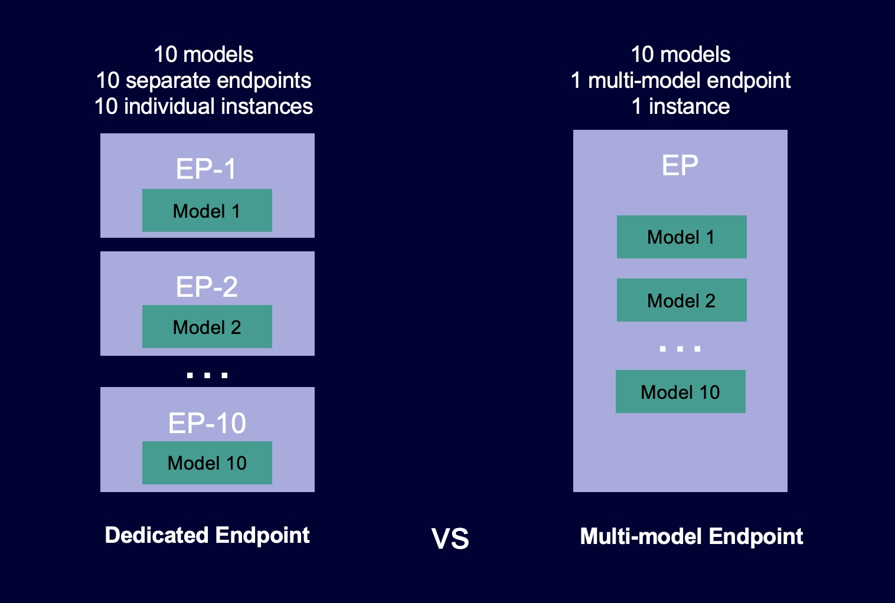

# Cost efficient and robust machine learning inference with Amazon SageMaker Multi-model Endpoints

The notebook content here extends the excellent blogpost published in February 2024 called 
[Run ML inference on unplanned and spiky traffic using Amazon SageMaker multi-model endpoints](https://aws.amazon.com/blogs/machine-learning/run-ml-inference-on-unplanned-and-spiky-traffic-using-amazon-sagemaker-multi-model-endpoints/).
The architecture outline and key points in that blogpost remain valid and I recommend you reading that 
in conjunction with this content. The official documentation on the service is also a 
key [reference](https://docs.aws.amazon.com/sagemaker/latest/dg/multi-model-endpoints.html).

What different and new with this content is:
* there is more of an emphasis on providing a variety of working examples to help you more easily translate your 
use case to this solution
* this demontrates having simultaneous use of different model classes (Scikit-learn and Setfit)
* the working examples work, while the code example referenced by the original blogpost no longer works 
due the container and python library version updates.

As noted in the original article: With this architecture, a software as a service (SaaS) business can break 
the linearly increasing cost of hosting multiple models,
and achieve reuse of infrastructure consistent with the multi-tenancy model applied elsewhere in the application stack. 

Before we go deeper, lets set the context some more. 
Multi-model endpoints provide a scalable and cost-effective solution to deploying large numbers of models. 
They use the same fleet of resources and a shared serving container to host all of your models. 
This reduces hosting costs by improving endpoint utilization compared with using single-model endpoints. 
It also reduces deployment overhead because Amazon SageMaker AI manages loading models in memory 
and scaling them based on the traffic patterns to your endpoint.

The following diagram shows how multi-model endpoints work compared to single-model endpoints.

This solution uses DJL Serving with an Amazon SageMaker Multi-model Endpoints (MME). 
As a result the configuration differs from the default MME setup. 
This is described clearly in the reference 
[blogpost](https://docs.aws.amazon.com/sagemaker/latest/dg/multi-model-endpoints.html). 
The change is not onerous and benefits are many. This includes:
* Low latency model serving with DJL serving
* Optional server configuration paramenters per model - such as the minimum and maximum workers
* Multiple serving options including support for deep learning models, statistical models, and workflows. 
It can serve the following model types out of the box:
  *  PyTorch TorchScript model 
    * TensorFlow SavedModel bundle
    * Apache MXNet model
    * ONNX model (CPU)
    * TensorRT model
    * Python script model
* With Python script mode, you can readily deploy models previously trained and deployed with native Python libraries, 
such as Scikit Learn and Setfit models, to the same SageMaker endpoint. 

This is what is demonstrated in the accompanying code.

* Notebook 0: Sets-up variables and content that will be used across the notebooks
* Notebook 1: Trains, evaluates, and packages a scikit-learn
Linear Regression model for deployment on a SageMaker Multi-Model Endpoint with DJL. 
This example is the simplist of the set with there being one input and one ouput variable.
It will only work correctly with a single record for inference.
* Notebook 2: Trains, evaluates, and packages a scikit-learn
ExtraTreesClassifier for deployment on a SageMaker Multi-Model Endpoint with DJL. 
The example model requires multiple input parameters, while outputing a single value. 
It works with one or more input records for inference.
* Notebook 3: Trains, evaluates, and packages a scikit-learn 
MultiOutputClassifier for deployment on a SageMaker Multi-Model Endpoint with DJL.
The example model requires multiple input parameters, while outputing a multiple output values. 
It works with one or more input records for inference.
* Notebook 4: Trains, evaluates, and packages a Setfit model.
The example model requires a sentence as its input parameter, and outputs one classification label per input. 
It works with one or more input records for inference.
* Notebook 5: Configures a SageMaker MME to run with a set of different models that have previously been trained
and packaged for DJL serving.
These example models used here, are the ones trained and packaged in the preceding notebooks. 
The Amazon SageMaker MME that gets deployed uses the Deep Java Library (DJL) Serving as the backend. 
It is configured to run on a CPU based instance, and can be readily adapted to run on a GPU based instance.
